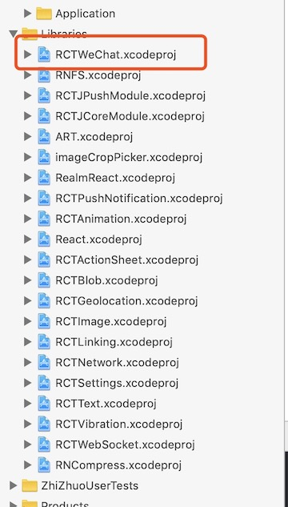
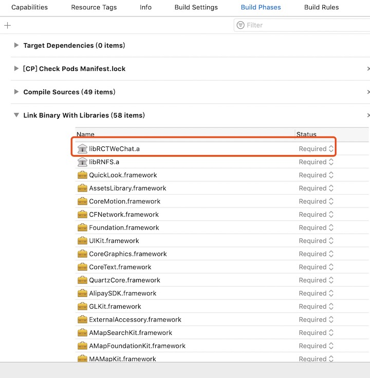

# react-native-wechat-with-miniprogram-share
在react-native-wechat@1.9.10组件版本的基础上增加了小程序分享,支持在线和本地图片分享

### 安装方法
执行npm i react-native-wechat-with-miniprogram-share --save安装组件

#### Android端配置
react-native link react-native-wechat-with-miniprogram-share链接Android原生模块

#### iOS端配置
将react-native-wechat-with-miniprogram-share/ios/RCTWeChat.xcodeproj文件拖入ios项目Libraries,并在TARGETS=>Build Phases=>Link Binary With Libraries添加libWeChatSDK.a静态库文件.
       

### 其他使用方法同[react-native-wechat](https://github.com/yorkie/react-native-wechat),微信小程序分享参考以下代码
```javascript
import * as WeChat from 'react-native-wechat-with-miniprogram-share';

export function shareToWXMiniProgram(id, title, thumb) {
    //微信应用注册
    WeChat.registerApp(wechatAppId);
    WeChat.isWXAppInstalled().then(isInstalled => {
        if (isInstalled) {
            //小程序分享链接自己根据参数进行拼接
            let shareUrl = 'xxx';
            //要分享的小程序id
            let miniUserName = 'xxx';
            WeChat.shareToWXMiniProgram({title, thumb,shareUrl,miniUserName})
                .then(wxShareResult => {
                    if (wxShareResult.errCode === 0) {
                        // Toast.success('分享成功');
                    }
                })
                .catch(error => {
                    console.log(error.message);
                    // Toast.message('分享失败');
                });
        } else {
            Toast.message('未安装微信');
        }
    });
}
```
